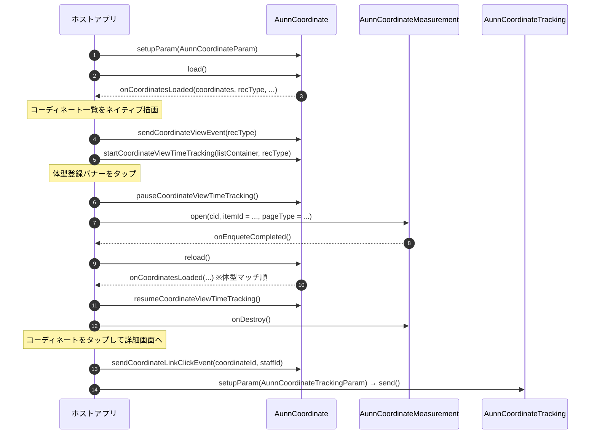

## ドキュメントのバージョン情報

- 26/08/13 初版作成。

# aunn コーディネート機能の実装について（Android）

aunn コーディネートは、ユーザーの体型・興味に合わせてスタッフコーディネートをレコメンドする機能です。
商品詳細画面などにスタッフコーディネートの一覧を表示し、ユーザーが体型を登録すると、その体型に合うスタッフのコーディネートが優先的に並ぶようになります。

本ドキュメントでは、EC アプリケーションへ aunn コーディネートを組み込む手順を説明します。各クラスのメソッド・パラメーターの詳細は、付属のドキュメント「[05.SDKリファレンス（Android）](./05.SDKリファレンス（Android）.md)」をご覧ください。

**すでに unisize バナー・CV タグを導入済みのアプリへ aunn を追加する場合は、本ドキュメント末尾の「[実装チェックリスト](#実装チェックリストunisize-導入済みのアプリに追加する場合)」もあわせてご利用ください。** 事前に確認しておく事項から動作確認までを一覧にしています。

なお本ドキュメントで「beid」と記載しているのは、unisize がユーザーを識別するために発行するユニークな ID です。体型登録の内容やコンバージョンの計測はこの ID に紐づけて管理されます。SDK が自動的に発行・保持するため、ホストアプリで値を生成・保存していただく必要はありません。

### お知らせ

本機能は unisizeSDK v3.0 から追加された機能です。
  
※ aunn コーディネートの導入には利用契約が別途必要となります。詳細については弊社営業担当までお問い合わせください。
  
---

## 役割分担（SDK / ホストアプリ）

aunn コーディネートでは、次の役割分担で機能を提供します。

- **コーディネート一覧の UI は、ホストアプリがネイティブ描画します。** SDK はコーディネートデータの取得と行動計測のみを担い、取得したコーディネート配列をアプリへ返します。アプリのデザインに合わせて自由に描画してください。
- **体型登録の UI は、SDK が WebView（`AunnCoordinateMeasurement`）で提供します。** 体型登録アプリをそのまま表示し、登録完了などの通知をネイティブへ橋渡しします。
- コーディネート一覧の取得・計測はネイティブ実装のため、体型登録画面以外で WebView は使用しません。

### 使用するクラス

| クラス | パッケージ | 役割 |
| :--- | :--- | :--- |
| `AunnCoordinate` | `jp.co.makip.unisizesdk.aunn.coordinate` | コーディネート一覧の取得と、コーディネート一覧画面での行動計測 |
| `AunnCoordinateMeasurement` | `jp.co.makip.unisizesdk.aunn.coordinate` | 体型登録アプリを表示する WebView |
| `AunnCoordinateTracking` | `jp.co.makip.unisizesdk.aunn.coordinate` | コーディネート詳細画面 / スタッフ画面の表示計測 |

---

## 実装の流れ

コーディネート一覧の表示から体型登録・再取得までの、ホストアプリと SDK のやり取りは次のとおりです。



---

## 1. コーディネート一覧の取得と表示（AunnCoordinate）

コーディネート一覧を表示する画面（商品詳細画面など）で `AunnCoordinate` を生成し、`setupParam()` でパラメーターを渡してから `load()` を呼びます。取得結果は `AunnCoordinateListener` で受け取ります。

###### Kotlin

```Kotlin
import android.util.Log
import jp.co.makip.unisizesdk.aunn.coordinate.AunnCoordinate
import jp.co.makip.unisizesdk.aunn.coordinate.AunnCoordinateItem
import jp.co.makip.unisizesdk.aunn.coordinate.AunnCoordinateListener
import jp.co.makip.unisizesdk.aunn.coordinate.AunnCoordinatePageType
import jp.co.makip.unisizesdk.aunn.coordinate.AunnCoordinateParam
import jp.co.makip.unisizesdk.aunn.coordinate.AunnCoordinateRecommendAlgorithm

val coordinate = AunnCoordinate(context)

coordinate.listener = object : AunnCoordinateListener {
    override fun onCoordinatesLoaded(
        coordinates: List<AunnCoordinateItem>,
        recType: AunnCoordinateRecommendAlgorithm,
        hasMore: Boolean,
        isBodyRegistered: Boolean,
        isBodyAndPreferenceSort: Boolean,
    ) {
        // コーディネート配列をネイティブ描画します（RecyclerView など）
        renderCoordinates(coordinates)

        // 体型登録バナーの出し分け（未登録＝登録導線 / 登録済み＝変更導線）
        // 登録済みバナーのラベルは isBodyAndPreferenceSort で
        // 「体型と好みで並べ替え」/「体型で並べ替え」を出し分けます
        showMeasurementBanner(
            registered = isBodyRegistered,
            bodyAndPreferenceSort = isBodyAndPreferenceSort,
        )

        // 描画できた時点の表示計測を送信します
        coordinate.sendCoordinateViewEvent(recType)

        // 実際に閲覧された時点の表示計測を、SDK に自動送信させます
        // （リストが 50% 以上・3 秒間表示され続けたときに 1 回送信されます）
        // （listContainer はコーディネート一覧のコンテナ View。メインスレッドから呼び出してください）
        coordinate.startCoordinateViewTimeTracking(listContainer, recType)

        // hasMore が true の場合「すべて見る」導線を表示できます
    }

    override fun onFail(error: jp.co.makip.unisizesdk.UnisizeError) {
        // エラーが発生した場合の処理
        Log.d("Aunn", "onFail: ${error.errMessage()}")
    }
}

coordinate.setupParam(
    AunnCoordinateParam(
        cid = "＜クライアントID＞",
        pageType = AunnCoordinatePageType.ITEM_DETAIL,
        coordinateCount = 6,
        itemId = "＜商品ID＞",  // ITEM_DETAIL / COORDINATE_ITEM では必須
        cuid = loginUserId,     // ECサイトログイン時のみ
        enablePrintLog = true,
    ),
)

coordinate.load()
```

- **コーディネート一覧の表示計測は 2 種類あり、両方を送信してください。** `sendCoordinateViewEvent()` は「コーディネート一覧が表示された」計測で、描画した直後に呼び出します。`startCoordinateViewTimeTracking()` は「コーディネート一覧が実際に閲覧された」計測で、リストが 50% 以上・3 秒間表示され続けたときに SDK が自動で送信します（画面外にコーディネート一覧がある場合は送信されません）。
- `pageType` には、コーディネート一覧を表示する画面の種別を指定します。商品詳細画面は `ITEM_DETAIL`、コーディネート一覧画面は `COORDINATE`（商品詳細から遷移した場合は `COORDINATE_ITEM`）、トップ画面は `TOP` です。
- `coordinateCount` には画面に表示する件数を指定します。SDK は「すべて見る」導線の要否（`hasMore`）を判定するために内部で 1 件多く取得しますが、`onCoordinatesLoaded()` へ返るのは指定件数までです。ただし取得できたコーディネートが指定件数に満たない場合もあるため、`coordinates.size` が常に `coordinateCount` と一致する前提にはしないでください。
- **コーディネートが 0 件で返る場合があります。** その場合はコーディネート一覧の領域ごと非表示にし、表示計測（`sendCoordinateViewEvent()`）・表示時間計測（`startCoordinateViewTimeTracking()`）も呼び出さないでください。
- **体型登録バナーを設置しない画面構成の場合は、`AunnCoordinateParam` の `hideMeasurementTag` に `true` を指定してください。** 計測データの区分が切り替わります。体型登録バナー自体の表示・非表示はホストアプリ側で制御してください（SDK は UI を表示しません）。
- 画面を破棄するときは、`stopCoordinateViewTimeTracking()` を呼び出して表示時間計測の監視を終了してください。

###### Kotlin

```Kotlin
override fun onDestroy() {
    coordinate.stopCoordinateViewTimeTracking()
    super.onDestroy()
}
```

---

## 2. コーディネートのクリック・体型マッチ切り替えの計測

コーディネートカードのタップや「すべて見る」のタップ、体型マッチの切り替えでは、対応する計測メソッドを呼び出します。画面遷移そのものはホストアプリが `AunnCoordinateItem` の値から組み立ててください。

###### Kotlin

```Kotlin
// コーディネートカードのタップ時（画像・スタッフ・ブランド・店舗リンクいずれも）
coordinate.sendCoordinateLinkClickEvent(coordinateId = item.id, staffId = item.staff.id)

// 「すべて見る」のタップ時
coordinate.sendMoreLinkClickEvent()

// 体型マッチ ON/OFF の切り替え時
// 切り替えると並び順が変わるため、必ず reload() でコーディネートを取り直してください
coordinate.toggleBodyMatching(enabled = true)
coordinate.reload()

// チェックボックスなどの初期表示には、現在の状態を useBodyMatching から取得します
// （初期値は true。ユーザーが切り替えた状態は SDK が保持します）
bodyMatchingCheckBox.isChecked = coordinate.useBodyMatching
```

- コーディネート一覧画面の表示計測・表示時間計測・クリック計測は、上記のメソッド呼び出しによって SDK が送信します。送信先や送信内容をホストアプリ側で意識する必要はありません。
- 表示時間計測は、`startCoordinateViewTimeTracking()` に渡した View が 50% 以上見えている状態が 3 秒続いたときに 1 回だけ送信されます。判定の基準となる面積は、View 全体の面積と画面の面積のうち小さい方です。監視対象の View が画面から取り外されると監視は自動的に終了するため、再表示する場合はあらためて呼び出してください。
- **コーディネート一覧の上に別の UI を重ねて表示する場合は、`pauseCoordinateViewTimeTracking()` で表示時間計測を一時停止し、閉じたときに `resumeCoordinateViewTimeTracking()` で再開してください。** 可視判定はコーディネート一覧の View 自体が画面内にあるかで行っているため、**上に重なったものによって隠れていることは検知できません。** 一時停止しないと、ユーザーがコーディネート一覧を見ていない間も表示時間が計測され続けます。

対象になるのは、たとえば次のようなケースです。

| ケース | 対応 |
| :--- | :--- |
| 体型登録アプリを表示する（「[3. 体型登録アプリの表示（AunnCoordinateMeasurement）](#3-体型登録アプリの表示aunncoordinatemeasurement)」参照） | 表示前に `pause`、閉じたときに `resume` |
| Dialog・DialogFragment・ボトムシート・全画面オーバーレイなどを重ねる | 同上 |
| 他の画面へ遷移する（コーディネート詳細画面・スタッフ画面など） | 同上。遷移元の画面を破棄する場合は `stopCoordinateViewTimeTracking()` でも構いません |

> Dialog を表示しても Activity の `onPause()` は呼ばれないため、ライフサイクルのコールバックだけでは一時停止できません。コーディネート一覧を覆う UI を表示・非表示するタイミングで明示的に呼び出してください。

---

## 3. 体型登録アプリの表示（AunnCoordinateMeasurement）

体型登録バナーがタップされたら、`AunnCoordinateMeasurement` を全画面（Dialog / 専用 Activity など）で表示します。beid（ユーザー識別子）は SDK が自動で引き継ぐため、ホストアプリで受け渡す必要はありません。

###### Kotlin

```Kotlin
import jp.co.makip.unisizesdk.aunn.coordinate.AunnCoordinateMeasurement
import jp.co.makip.unisizesdk.aunn.coordinate.AunnCoordinateMeasurementListener
import jp.co.makip.unisizesdk.aunn.coordinate.AunnCoordinatePageType

// コーディネート一覧を覆うため、表示時間計測を一時停止します
coordinate.pauseCoordinateViewTimeTracking()

val measurement = AunnCoordinateMeasurement(context)
measurement.listener = object : AunnCoordinateMeasurementListener {
    // 体型登録が完了したタイミングで実行される
    override fun onEnqueteCompleted() {
        measurementDialog?.dismiss()
        coordinate.reload()   // コーディネートを再取得します
    }

    // 「購入を続ける」で閉じられたタイミングで実行される
    override fun onClosed() {
        measurementDialog?.dismiss()
    }

    // エラーが発生したタイミングで実行される
    override fun onFail(error: jp.co.makip.unisizesdk.UnisizeError) {
        measurementDialog?.dismiss()
    }
}

measurement.open(
    cid = "＜クライアントID＞",
    itemId = "＜商品ID＞",
    cuid = loginUserId,   // ECサイトログイン時のみ
    pageType = AunnCoordinatePageType.ITEM_DETAIL,
    enablePrintLog = true,
)

// 全画面の Dialog で表示します（measurementDialog は Activity のフィールド）
measurementDialog = Dialog(context, android.R.style.Theme_Black_NoTitleBar_Fullscreen).apply {
    setContentView(measurement)
    // どの経路で閉じても必ず通るように、後片付けは閉じるタイミングにまとめます
    setOnDismissListener {
        coordinate.resumeCoordinateViewTimeTracking()
        measurement.onDestroy()
        measurementDialog = null
    }
    show()
}
```

体型登録アプリが閉じる経路と、そのとき通知されるコールバックは次のとおりです。

| 閉じる経路 | 通知されるコールバック |
| :--- | :--- |
| 体型登録が完了した | `onEnqueteCompleted()` |
| 「購入を続ける」で閉じられた | `onClosed()` |
| エラーが発生した | `onFail(error)` |
| バックキー・画面外のタップなどで閉じられた | **通知はありません** |

- **バックキーで閉じられた場合、SDK からの通知はありません。** そのため、上記サンプルのように `Dialog` の `setOnDismissListener`（専用 Activity の場合は `onDestroy()`）へ後片付けをまとめてください。各コールバックに個別に書くと、バックキーの経路だけ後片付けが漏れます。
- **後片付けでは必ず `measurement.onDestroy()` を呼んでください。** 呼ばない場合、WebView（レンダリング・JS タイマー等）が GC まで残り、体型登録アプリを連続で開くとインスタンスが累積します。
- `onDestroy()` を呼んだあとのインスタンスは**再利用できません**。再表示するときは新規に `AunnCoordinateMeasurement` を生成してください。
- `onFail()` が呼ばれても SDK は画面を閉じません。エラー時にそのままでは操作できない画面が残るため、ホストアプリ側で閉じる処理を実装してください。
- 体型登録アプリのオープン計測・完了計測は `AunnCoordinateMeasurement` が自動で送信します。ホストアプリで必要なのは、完了後のコーディネート再取得（`reload()`）のみです。

---

## 4. コーディネート詳細画面 / スタッフ画面の計測（AunnCoordinateTracking）

コーディネート詳細画面・スタッフ画面では、`AunnCoordinateTracking` を生成して `send()` を 1 回呼びます。

###### Kotlin

```Kotlin
import jp.co.makip.unisizesdk.aunn.coordinate.AunnCoordinatePageType
import jp.co.makip.unisizesdk.aunn.coordinate.AunnCoordinateTracking
import jp.co.makip.unisizesdk.aunn.coordinate.AunnCoordinateTrackingParam

AunnCoordinateTracking(context).apply {
    setupParam(
        AunnCoordinateTrackingParam(
            cid = "＜クライアントID＞",
            pageType = AunnCoordinatePageType.COORDINATE_DETAIL,  // または AunnCoordinatePageType.STAFF
            coordinateId = coordinateId,                  // COORDINATE_DETAIL のとき
            staffId = staffId,                            // STAFF のとき
        ),
    )
    send()
}
```

- **コーディネート一覧から遷移してきた場合は、遷移元で `sendCoordinateLinkClickEvent()` を呼んでから画面遷移してください。** クリック計測がレコメンドの精度向上に使われるため、遷移先の表示計測と対応づける必要があります。クリックから一定時間内の遷移のみが対応づけの対象になるため、`startActivity()` の**前**に呼び出してください。
- 画面回転などで `onCreate()` が再実行されるときに `send()` が二重に呼ばれないようご注意ください（`savedInstanceState` が `null` のときのみ送信するなど）。

---

## unisize バナー・CV タグと同居する場合

同一アプリ内で unisize バナー（`UnisizeBanner`）や CV タグ（`UnisizeCVTag`）もあわせてご利用いただく場合は、次の 2 点にご対応ください。

### beid の共有（unisizeBeidWaitMs の指定）

aunn と unisize は、同じ beid（ユーザー識別子）でユーザーを紐付ける必要があります。SDK は両者の beid を自動的に共有しますが、**商品詳細画面（`ITEM_DETAIL`）でのみ**、unisize バナー側の beid 発行を待ってから採用する動作をします。

この待機時間の上限は `AunnCoordinateParam.unisizeBeidWaitMs`（既定 3000 ミリ秒）で指定します。

- **unisize バナーを同居させる画面**: 既定値のままで問題ありません。beid が発行された時点で待機は即座に終了するため、通常は上限まで待つことはありません。
- **unisize バナーを同居させない画面**: 待つ対象が無く上限まで待ち続けてしまうため、**`0` を指定して待機を無効化してください**。

同居の有無や端末性能等は SDK 側から判断できないため、画面に応じてホストアプリで指定していただく必要があります。`ITEM_DETAIL` 以外の `pageType` では、この値は使用されません。

### 体型登録結果の相互反映

体型登録の結果は beid に紐づけてサーバー側に保持されるため、同じ beid で相手側を再ロードすれば最新の状態が反映されます。**aunn → unisize の方向は SDK が自動で反映するため、ホストアプリの実装は不要です。** unisize → aunn の方向のみ、ホストアプリで配線してください。

| 状態変化 | 受け取るコールバック | ホストアプリの対応 |
| :--- | :--- | :--- |
| aunn で体型登録が完了した | `AunnCoordinateMeasurementListener.onEnqueteCompleted()` | `coordinate.reload()` でコーディネートを再取得します（unisize バナーへの反映は SDK が自動で行うため `unisizeBanner.show()` は不要です） |
| aunn で beid が差し替わった | `AunnCoordinateMeasurementListener.onBeidChanged()` | 対応不要（SDK が自動で反映します） |
| aunn のコーディネート取得で beid が確定した | `AunnCoordinateListener.onBeidChanged()` | 対応不要（SDK が自動で反映します） |
| **unisize 側で体型登録／サイズレコメンドが行われた** | `UnisizeBannerListener.didBeidChanged()` | **`coordinate.reload()`** を呼び、コーディネート（体型マッチ順・体型登録バナーの表示）を最新化します |

###### Kotlin

```Kotlin
// aunn の体型登録完了 → aunn コーディネートのみ再取得します
override fun onEnqueteCompleted() {
    coordinate.reload()
}

// unisize 側の体型変化 → aunn コーディネートを最新化します
override fun didBeidChanged(beid: String, recommendedItems: String, type: String) {
    coordinate.reload()
}
```

### CV タグ（UnisizeCVTag）との beid の共有

`UnisizeCVTag` が使用する beid も SDK が自動的に aunn と一致させるため、コンバージョン計測のための追加実装は不要です。CV タグの実装方法は、付属のドキュメント「[03.unisize の コンバージョンの実装について（Kotlin）](./03.unisizeの%20コンバージョンの実装について（Kotlin）.md)」をご覧ください。

---

## 実装チェックリスト（unisize 導入済みのアプリに追加する場合）

すでに unisize バナー・CV タグを導入いただいているアプリへ aunn コーディネートを追加する際の作業一覧です。

**既存の unisize の実装を変更する必要はありません。** クライアント ID・商品 ID・会員 ID も unisize バナーへ渡している値をそのままご利用いただけるため、新たにご用意いただく値はありません。

### 0. 事前確認（実装に着手する前に）

- [ ] 現在ご利用中の unisizeSDK のバージョンを確認した（v3.0 未満の場合は 1 のアップデートが必要です）
- [ ] 体型登録バナーを設置するかどうかを決めた（設置しない場合は `AunnCoordinateParam` の `hideMeasurementTag` に `true` を指定します）

### 1. SDK のアップデート

- [ ] unisizeSDK を v3.0 に差し替えた（付属のドキュメント「[08.下位バージョンからのアップデートに関して（Android）](./08.下位バージョンからのアップデートに関して（Android）.md)」を参照）
- [ ] 差し替え後、既存の unisize バナー・アンケート・CV タグが従来どおり動作することを確認した

### 2. 共通の準備

- [ ] クライアント ID・商品 ID・会員 ID は、unisize バナーへ渡している値をそのまま使用する（新たに用意する値はありません）
- [ ] コーディネート画像・スタッフ画像を表示するための画像読み込み処理を用意した（SDK は画像の URL 文字列のみを返します。表示は Glide / Coil などホストアプリ側の仕組みで行ってください）
- [ ] コード難読化（minify）を有効にしている場合、`AunnCoordinatePageType` などの enum が保持される設定になっていることを確認した

### 3. 画面ごとの実装

まず、実装が必要な画面と使用するクラスの対応です。

| 画面 | 使用するクラス | `pageType` |
| :--- | :--- | :--- |
| コーディネート一覧を表示する画面（商品詳細画面など） | `AunnCoordinate` | トップ画面は `TOP` 、商品詳細は `ITEM_DETAIL` を指定 |
| 「すべて見る」の遷移先（コーディネート一覧画面） | `AunnCoordinate` | `COORDINATE`（商品詳細から遷移した場合は `COORDINATE_ITEM`） |
| 体型登録画面 | `AunnCoordinateMeasurement` | `open()` に呼び出し元画面の種別を指定 |
| コーディネート詳細画面 | `AunnCoordinateTracking` | `COORDINATE_DETAIL` |
| スタッフ画面 | `AunnCoordinateTracking` | `STAFF` |

> **「すべて見る」の遷移先に専用の API はありません。** 遷移元より大きい `coordinateCount` を指定して `AunnCoordinate` をもう一度使うことで実現します（たとえば遷移元が 6 件なら、遷移先では 100 件を指定します）。

**コーディネート一覧を表示する画面**（詳細は「[1. コーディネート一覧の取得と表示（AunnCoordinate）](#1-コーディネート一覧の取得と表示aunncoordinate)」「[2. コーディネートのクリック・体型マッチ切り替えの計測](#2-コーディネートのクリック体型マッチ切り替えの計測)」）

- [ ] `listener` を設定してから `setupParam()` → `load()` の順に呼び出している
- [ ] `onCoordinatesLoaded()` でコーディネート一覧をネイティブ描画している
- [ ] コーディネートが 0 件のときは一覧の領域ごと非表示にし、表示計測を送信しないようにしている
- [ ] 描画後に `sendCoordinateViewEvent()` を呼び出している
- [ ] 描画後に `startCoordinateViewTimeTracking()` を呼び出している（`reload()` による再描画のたびに毎回必要です）
- [ ] `isBodyRegistered` / `isBodyAndPreferenceSort` で体型登録バナーの表示を出し分けている
- [ ] `hasMore` が `true` のときに「すべて見る」導線を表示している
- [ ] コーディネートをタップしたとき、**画面遷移の前に** `sendCoordinateLinkClickEvent()` を呼び出している
- [ ] 「すべて見る」をタップしたとき `sendMoreLinkClickEvent()` を呼び出している
- [ ] 体型マッチの切り替えで `toggleBodyMatching()` → `reload()` を呼び出している（チェックボックスの初期状態は `useBodyMatching` から取得します）
- [ ] **コーディネート一覧を覆う UI（Dialog・ボトムシート・全画面オーバーレイなど）を表示する間と、他の画面へ遷移する間は `pauseCoordinateViewTimeTracking()` / `resumeCoordinateViewTimeTracking()` を呼び出している**（重なりによる遮蔽は SDK では検知できません）
- [ ] 画面の破棄時に `stopCoordinateViewTimeTracking()` を呼び出している

**「すべて見る」の遷移先**

- [ ] 遷移元より大きい `coordinateCount` を指定して `AunnCoordinate` を使用している
- [ ] `pageType` に `COORDINATE`（商品詳細画面から遷移した場合は `COORDINATE_ITEM`）を指定している

**体型登録画面**（詳細は「[3. 体型登録アプリの表示（AunnCoordinateMeasurement）](#3-体型登録アプリの表示aunncoordinatemeasurement)」）

- [ ] 開く前に `pauseCoordinateViewTimeTracking()` を呼び出している
- [ ] `AunnCoordinateMeasurement` を全画面で表示し、`open()` を呼び出している
- [ ] `onEnqueteCompleted()`（体型登録の完了）で画面を閉じ、`coordinate.reload()` を呼び出している
- [ ] `onClosed()`（「購入を続ける」）で画面を閉じている
- [ ] `onFail(error)`（エラー発生）で画面を閉じている（SDK は自動では閉じません）
- [ ] **バックキーで閉じられた場合はコールバックが無いため、後片付けを `Dialog.setOnDismissListener`（専用 Activity なら `onDestroy()`）にまとめている**
- [ ] その後片付けで `resumeCoordinateViewTimeTracking()` と `measurement.onDestroy()` を呼び出している
- [ ] 再表示するときは `AunnCoordinateMeasurement` を新規に生成している（`onDestroy()` 後のインスタンスは再利用できません）

**コーディネート詳細画面 / スタッフ画面**（詳細は「[4. コーディネート詳細画面 / スタッフ画面の計測（AunnCoordinateTracking）](#4-コーディネート詳細画面--スタッフ画面の計測aunncoordinatetracking)」）

- [ ] `AunnCoordinateTracking` で `setupParam()` → `send()` を画面表示時に 1 回呼び出している
- [ ] 画面回転などで `send()` が二重に呼ばれないようにしている

### 4. unisize バナーと同居する画面の追加対応

詳細は「[unisize バナー・CV タグと同居する場合](#unisize-バナーcv-タグと同居する場合)」をご覧ください。

- [ ] `ITEM_DETAIL` を指定する画面のうち、**unisize バナーを設置していない画面**では `AunnCoordinateParam` の `unisizeBeidWaitMs` に `0` を指定した
- [ ] `UnisizeBannerListener.didBeidChanged()` で `coordinate.reload()` を呼び出している（メインスレッドから呼び出してください）
- [ ] aunn の体型登録完了後に `unisizeBanner.show()` を呼び出していない（unisize バナーへの反映は SDK が自動で行います）
- [ ] CV タグについては追加の実装を行っていない（beid は SDK が自動的に一致させます）

### 5. 動作確認

- [ ] コーディネート一覧が表示される（0 件の場合は、クライアント ID の aunn 有効化と商品 ID をご確認ください）
- [ ] 体型未登録の状態と登録済みの状態で、体型登録バナーの表示が切り替わる
- [ ] 体型登録を完了するとコーディネートの並び順が変わる
- [ ] 体型マッチを切り替えるとコーディネートの並び順が変わる
- [ ] 「すべて見る」・コーディネート詳細画面・スタッフ画面への遷移が正しく動作する
- [ ] 体型登録画面を繰り返し開閉してもメモリ使用量が増え続けない
- [ ] （unisize と同居する場合）aunn で体型登録すると、unisize バナーが登録済みの表示に変わる
- [ ] （unisize と同居する場合）unisize で体型登録すると、コーディネートの並び順が変わる

### 6. リリース前の確認

- [ ] `enablePrintLog` を `false` に戻した（`AunnCoordinateParam` / `AunnCoordinateTrackingParam` / `AunnCoordinateMeasurement.open()` のすべて）
- [ ] 本番環境での動作確認は、テスト用のクライアント ID・テスト商品で行った（実表示・実購入として集計されるため）

---

## 注意点

- コーディネート一覧の UI はホストアプリがネイティブ描画します。SDK は UI を提供しません（体型登録アプリの WebView を除く）。
- コーディネート一覧は SDK 内部で 1 時間キャッシュされます。ただし体型登録の前後ではリクエスト条件が変わるため、`reload()` を呼べば登録結果が反映されたコーディネートを取得できます。
- エラーコードは付属のドキュメント「[06.エラーコード一覧（Android）](./06.エラーコード一覧（Android）.md)」の「aunn コーディネートのエラー」をご覧ください。
- 各クラスのメソッド・パラメーターの詳細は、付属のドキュメント「[05.SDKリファレンス（Android）](./05.SDKリファレンス（Android）.md)」をご覧ください。
