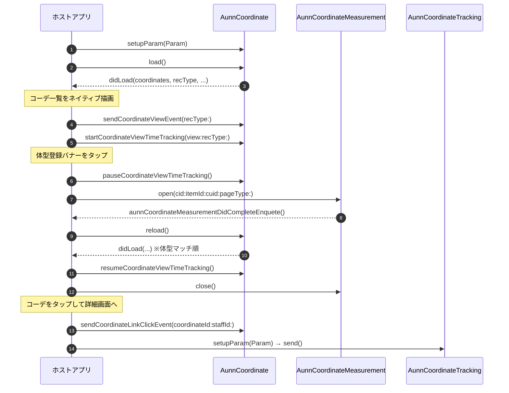

## ドキュメントのバージョン情報
- 26/08/31 初版

# aunn コーディネート機能の実装について（iOS）

aunn コーディネート機能は、ユーザーの体型・興味に合わせてスタッフコーディネート（以下「コーデ」）をレコメンドする機能です。
商品詳細画面などにスタッフコーデの一覧を表示し、ユーザーが体型を登録すると、その体型に合うスタッフのコーデが優先的に並ぶようになります。

本ドキュメントでは、EC アプリケーションへ aunn コーディネート機能を組み込む手順を説明します。各クラスのメソッド・パラメーターの詳細は、付属のドキュメント「[03.SDKリファレンス（Swift）](./03.SDKリファレンス（Swift）.md)」をご覧ください。

**すでに unisize バナー・CV タグを導入済みのアプリへ aunn を追加する場合は、本ドキュメント末尾の「[実装チェックリスト](#実装チェックリストunisize-導入済みのアプリに追加する場合)」もあわせてご利用ください。** 事前に確認しておく事項から動作確認までを一覧にしています。

なお本ドキュメントで「beid」と記載しているのは、unisize がユーザーを識別するために発行するユニークな ID です。体型登録の内容やコンバージョンの計測はこの ID に紐づけて管理されます。SDK が自動的に発行・保持するため、ホストアプリで値を生成・保存していただく必要はありません。

### お知らせ

本機能は unisizeSDK v3.0 から追加された機能です。  
また v3.0 時点では **Swift 専用**です。Objective-C で開発されたプロジェクトからはご利用いただけません。

※ aunn コーディネートの導入には利用契約が別途必要となります。詳細については弊社営業担当までお問い合わせください。
  

---

## 役割分担（SDK / ホストアプリ）

aunn コーディネート機能では、次の役割分担で機能を提供します。

- **コーデ一覧の UI は、ホストアプリがネイティブ描画します。** SDK はコーデデータの取得と行動計測のみを担い、取得したコーディネート配列をアプリへ返します。アプリのデザインに合わせて自由に描画してください。
- **体型登録の UI は、SDK が `WKWebView`（`AunnCoordinateMeasurement`）で提供します。** 体型登録アプリをそのまま表示し、登録完了などの通知をネイティブへ橋渡しします。
- コーデ一覧の取得・計測はネイティブ実装のため、体型登録画面以外で `WKWebView` は使用しません。

### 使用するクラス

| クラス | モジュール | 役割 |
| :--- | :--- | :--- |
| `AunnCoordinate` | `unisizeSDK` | コーデ一覧の取得と、コーデ一覧画面での行動計測 |
| `AunnCoordinateMeasurement` | `unisizeSDK` | 体型登録アプリを表示する `WKWebView` |
| `AunnCoordinateTracking` | `unisizeSDK` | コーデ詳細画面 / スタッフ画面の表示計測 |

---

## 実装の流れ

コーデ一覧の表示から体型登録・再取得までの、ホストアプリと SDK のやり取りは次のとおりです。



---

## 1. コーデ一覧の取得と表示（AunnCoordinate）

コーデ一覧を表示する画面（商品詳細画面など）で `AunnCoordinate` を生成し、`setupParam()` でパラメーターを渡してから `load()` を呼びます。取得結果は `AunnCoordinateDelegate` で受け取ります。

###### Swift

```swift
import unisizeSDK

let coordinate = AunnCoordinate()

extension 【コーデ一覧を表示する画面の ViewController】: AunnCoordinateDelegate {

    // コーデ取得完了時に実行される
    func aunnCoordinate(
        _ coordinate: AunnCoordinate,
        didLoad coordinates: [AunnCoordinateItem],
        recType: AunnCoordinateRecommendAlgorithm,
        hasMore: Bool,
        isBodyRegistered: Bool,
        isBodyAndPreferenceSort: Bool
    ) {
        // コーデ配列をネイティブ描画します（UICollectionView など）
        renderCoordinates(coordinates)

        // 体型登録バナーの出し分け（未登録＝登録導線 / 登録済み＝変更導線）
        // 登録済みバナーのラベルは isBodyAndPreferenceSort で
        // 「体型と好みで並べ替え」/「体型で並べ替え」を出し分けます
        showMeasurementBanner(
            registered: isBodyRegistered,
            bodyAndPreferenceSort: isBodyAndPreferenceSort
        )

        // 描画できた時点の表示計測を送信します
        coordinate.sendCoordinateViewEvent(recType: recType)

        // 実際に閲覧された時点の表示計測を、SDK に自動送信させます
        // （コーデ一覧が 50% 以上・3 秒間表示され続けたときに 1 回送信されます）
        // （collectionView はコーデ一覧のコンテナ View。メインスレッドから呼び出してください）
        coordinate.startCoordinateViewTimeTracking(view: collectionView, recType: recType)

        // hasMore が true の場合「すべて見る」導線を表示できます
    }

    // エラーが発生した場合の処理
    func aunnCoordinate(_ coordinate: AunnCoordinate, didFail error: UnisizeError) {
        print("didFail: \(error.getJsonString())")
    }
}

coordinate.delegate = self

coordinate.setupParam(
    AunnCoordinate.Param(
        cid: "＜クライアントID＞",
        pageType: .itemDetail,
        coordinateCount: 6,
        itemId: "＜商品ID＞",  // .itemDetail / .coordinationItem では必須
        cuid: loginUserId,    // ECサイトログイン時のみ
        enablePrintLog: true
    )
)

coordinate.load()
```

- `load()` は通信をバックグラウンドで実行し、**Delegate は必ずメインスレッド**で呼び出します。
- **コーデ一覧の表示計測は 2 種類あり、両方を送信してください。** `sendCoordinateViewEvent(recType:)` は「コーデ一覧が表示された」計測で、描画した直後に呼び出します。`startCoordinateViewTimeTracking(view:recType:)` は「コーデ一覧が実際に閲覧された」計測で、コーデ一覧が 50% 以上・3 秒間表示され続けたときに SDK が自動で送信します（画面外にコーデ一覧がある場合は送信されません）。
- `pageType`（`AunnCoordinatePageType`）には、コーデ一覧を表示する画面の種別を指定します。商品詳細画面は `.itemDetail`、コーデ一覧画面は `.coordination`（商品詳細から遷移した場合は `.coordinationItem`）、トップ画面は `.top` です。
- `coordinateCount` には画面に表示する件数を指定します。SDK は「すべて見る」導線の要否（`hasMore`）を判定するために内部で 1 件多く取得しますが、`didLoad` へ返るのは指定件数までです。ただし取得できたコーデが指定件数に満たない場合もあるため、`coordinates.count` が常に `coordinateCount` と一致する前提にはしないでください。
- **コーデが 0 件で返る場合があります。** その場合はコーデ一覧の領域ごと非表示にし、表示計測（`sendCoordinateViewEvent(recType:)`）・表示時間計測（`startCoordinateViewTimeTracking(view:recType:)`）も呼び出さないでください。
- **体型登録バナーを設置しない画面構成の場合は、`AunnCoordinate.Param` の `hideMeasurementTag` に `true` を指定してください。** 計測データの区分が切り替わります。体型登録バナー自体の表示・非表示はホストアプリ側で制御してください（SDK は UI を表示しません）。
- 画面を破棄するときは、`stopCoordinateViewTimeTracking()` を呼び出して表示時間計測の監視を終了してください。

###### Swift

```swift
override func viewDidDisappear(_ animated: Bool) {
    super.viewDidDisappear(animated)
    if isMovingFromParent || isBeingDismissed {
        coordinate.stopCoordinateViewTimeTracking()
    }
}
```

---

## 2. コーデのクリック・体型マッチ切り替えの計測

コーデカードのタップや「すべて見る」のタップ、体型マッチの切り替えでは、対応する計測メソッドを呼び出します。画面遷移そのものはホストアプリが `AunnCoordinateItem` の値から組み立ててください。

###### Swift

```swift
// コーデカードのタップ時（画像・スタッフ・ブランド・店舗リンクいずれも）
coordinate.sendCoordinateLinkClickEvent(coordinateId: item.id, staffId: item.staff.id)

// 「すべて見る」のタップ時
coordinate.sendMoreLinkClickEvent()

// 体型マッチ ON/OFF の切り替え時
// 切り替えると並び順が変わるため、必ず reload() でコーデを取り直してください
coordinate.toggleBodyMatching(enabled: true)
coordinate.reload()

// スイッチなどの初期表示には、現在の状態を useBodyMatching から取得します
// （初期値は true。ユーザーが切り替えた状態は SDK が保持します）
bodyMatchingSwitch.setOn(coordinate.useBodyMatching, animated: false)
```

- コーデ一覧画面の表示計測・表示時間計測・クリック計測は、上記のメソッド呼び出しによって SDK が送信します。送信先や送信内容をホストアプリ側で意識する必要はありません。
- 表示時間計測は、`startCoordinateViewTimeTracking(view:recType:)` に渡した View が 50% 以上見えている状態が 3 秒続いたときに 1 回だけ送信されます。判定の基準となる面積は、View 全体の面積と画面の面積のうち小さい方です。監視対象の View がウィンドウから外れると監視は自動的に終了するため、再表示する場合はあらためて呼び出してください。
- **コーデ一覧の上に別の UI を重ねて表示する場合は、`pauseCoordinateViewTimeTracking()` で表示時間計測を一時停止し、閉じたときに `resumeCoordinateViewTimeTracking()` で再開してください。** 可視判定はコーデ一覧の View 自体が画面内にあるかで行っているため、**上に重なったものによって隠れていることは検知できません。** 一時停止しないと、ユーザーがコーデ一覧を見ていない間も表示時間が計測され続けます。
- 商品 URL・コーデ詳細 URL・スタッフ詳細 URL は `AunnCoordinateItem` に含まれません。画面遷移は `id` / `staff` / `brand` / `shop` などの値からホストアプリ側で組み立ててください。

対象になるのは、たとえば次のようなケースです。

| ケース | 対応 |
| :--- | :--- |
| 体型登録アプリを表示する（「[3. 体型登録アプリの表示（AunnCoordinateMeasurement）](#3-体型登録アプリの表示aunncoordinatemeasurement)」参照） | 表示前に `pause`、閉じたときに `resume` |
| モーダル・アクションシート・全画面オーバーレイなどを重ねる | 同上 |
| 他の画面へ遷移する（コーデ詳細画面・スタッフ画面など） | 同上。遷移元の画面を破棄する場合は `stopCoordinateViewTimeTracking()` でも構いません |

> モーダルを重ねてもコーデ一覧の View 自体はウィンドウ上に残るため、ライフサイクルのコールバックだけでは一時停止できません。コーデ一覧を覆う UI を表示・非表示するタイミングで明示的に呼び出してください。

---

## 3. 体型登録アプリの表示（AunnCoordinateMeasurement）

体型登録バナーがタップされたら、`AunnCoordinateMeasurement` を全画面（modal 表示の `UIViewController` など）で表示します。beid（ユーザー識別子）は SDK が自動で引き継ぐため、ホストアプリで受け渡す必要はありません。

###### Swift

```swift
import unisizeSDK

// コーデ一覧を覆うため、表示時間計測を一時停止します
coordinate.pauseCoordinateViewTimeTracking()

let measurement = AunnCoordinateMeasurement()

extension 【体型登録画面の ViewController】: AunnCoordinateMeasurementDelegate {

    // 体型登録が完了したタイミングで実行される
    func aunnCoordinateMeasurementDidCompleteEnquete(_ measurement: AunnCoordinateMeasurement) {
        dismissMeasurement()
        coordinate.reload()   // コーデを再取得します
    }

    // 「購入を続ける」で閉じられたタイミングで実行される
    func aunnCoordinateMeasurementDidClose(_ measurement: AunnCoordinateMeasurement) {
        dismissMeasurement()
    }

    // エラーが発生したタイミングで実行される
    func aunnCoordinateMeasurement(_ measurement: AunnCoordinateMeasurement, didFail error: UnisizeError) {
        dismissMeasurement()
    }
}

measurement.delegate = self

// measurement.view（WKWebView）を全画面コンテナへ配置します
let webView = measurement.view
containerView.addSubview(webView)
NSLayoutConstraint.activate([
    webView.topAnchor.constraint(equalTo: containerView.topAnchor),
    webView.bottomAnchor.constraint(equalTo: containerView.bottomAnchor),
    webView.leadingAnchor.constraint(equalTo: containerView.leadingAnchor),
    webView.trailingAnchor.constraint(equalTo: containerView.trailingAnchor),
])

measurement.open(
    cid: "＜クライアントID＞",
    itemId: "＜商品ID＞",
    cuid: loginUserId,     // ECサイトログイン時のみ（省略時は AunnCoordinate の cuid を引き継ぎます）
    pageType: .itemDetail,
    enablePrintLog: true
)
```

体型登録アプリが閉じる経路と、そのとき通知される Delegate は次のとおりです。

| 閉じる経路 | 通知される Delegate |
| :--- | :--- |
| 体型登録が完了した | `aunnCoordinateMeasurementDidCompleteEnquete(_:)` |
| 「購入を続ける」で閉じられた | `aunnCoordinateMeasurementDidClose(_:)` |
| エラーが発生した | `aunnCoordinateMeasurement(_:didFail:)` |
| スワイプダウンなど、ホストアプリ側の操作で閉じられた | **通知はありません** |

- **スワイプダウンや「戻る」などホストアプリ側の操作で閉じられた場合、SDK からの通知はありません。** そのため、後片付けは各 Delegate に個別に書くのではなく、`UIAdaptivePresentationControllerDelegate` の `presentationControllerDidDismiss(_:)` や `dismiss(animated:completion:)` の完了ハンドラなど、**閉じるすべての経路が通る場所へまとめて**実装してください。
- **後片付けでは必ず `measurement.close()` と `coordinate.resumeCoordinateViewTimeTracking()` を呼んでください。** `close()` は読み込みの停止と JS ブリッジの解除を行います。
- `close()` を呼び出したあとのインスタンスは、再度 `open()` することで再利用できます。
- `open()` は共有されている beid の解決を非同期で行うため、**画面の読み込みとオープン計測の送信は `open()` から戻ったあとに実行されます。** 解決前に `close()` を呼び出した場合、読み込みは行われません。
- `aunnCoordinateMeasurement(_:didFail:)` が呼ばれても SDK は画面を閉じません。エラー時にそのままでは操作できない画面が残るため、ホストアプリ側で閉じる処理を実装してください。
- 体型登録アプリのオープン計測・完了計測は `AunnCoordinateMeasurement` が自動で送信します。ホストアプリで必要なのは、完了後のコーデ再取得（`reload()`）のみです。
- `measurement.view` は `translatesAutoresizingMaskIntoConstraints = false` が設定済みです。AutoLayout で配置してください。

---

## 4. コーデ詳細画面 / スタッフ画面の計測（AunnCoordinateTracking）

コーデ詳細画面・スタッフ画面では、`AunnCoordinateTracking` を生成して `send()` を 1 回呼びます。

###### Swift

```swift
import unisizeSDK

let tracking = AunnCoordinateTracking()
tracking.setupParam(
    AunnCoordinateTracking.Param(
        cid: "＜クライアントID＞",
        pageType: .coordinationDetail,  // または .staff
        coordinateId: coordinateId,     // .coordinationDetail のとき
        staffId: staffId                // .staff のとき
    )
)
tracking.send()
```

- **コーデ一覧から遷移してきた場合は、遷移元で `sendCoordinateLinkClickEvent(coordinateId:staffId:)` を呼んでから画面遷移してください。** クリック計測がレコメンドの精度向上に使われるため、遷移先の表示計測と対応づける必要があります。クリックから 10 秒以内の遷移のみが対応づけの対象になるため、画面遷移の**前**に呼び出してください。
- `send()` は fire-and-forget です。Delegate は持たず、ローカル変数として使い捨てるインスタンスでも送信は完了します。パラメーターに不備がある場合は `enablePrintLog` の指定に関わらず Xcode のコンソールへ出力されます。
- 画面の再表示などで `send()` が二重に呼ばれないようご注意ください（`viewDidLoad()` で 1 回のみ送信するなど）。

---

## unisize バナー・CV タグと同居する場合

同一アプリ内で unisize バナー（`UnisizeBannerWebview` / `UnisizeBanner`）や CV タグ（`UnisizeCVTag`）もあわせてご利用いただく場合は、次の 2 点にご対応ください。

### beid の共有（unisizeBeidWaitMs の指定）

aunn と unisize は、同じ beid（ユーザー識別子）でユーザーを紐付ける必要があります。SDK は両者の beid を自動的に共有しますが、**商品詳細画面（`.itemDetail`）でのみ**、unisize バナー側の beid 発行を待ってから採用する動作をします。

この待機時間の上限は `AunnCoordinate.Param` の `unisizeBeidWaitMs`（既定 3000 ミリ秒）で指定します。

- **unisize バナーを同居させる画面**: 既定値のままで問題ありません。beid が発行された時点で待機は即座に終了するため、通常は上限まで待つことはありません。
- **unisize バナーを同居させない画面**: 待つ対象が無く上限まで待ち続けてしまうため、**`0` を指定して待機を無効化してください**。

同居の有無や端末性能等は SDK 側から判断できないため、画面に応じてホストアプリで指定していただく必要があります。`.itemDetail` 以外の `pageType` では、この値は使用されません。  
確定した beid は `aunnCoordinate(_:didChangeBeid:)` で通知されます（実装は任意です）。

### 体型登録結果の相互反映

体型登録の結果は beid に紐づけてサーバー側に保持されるため、同じ beid で相手側を再ロードすれば最新の状態が反映されます。**aunn → unisize の方向は SDK が自動で反映するため、ホストアプリの実装は不要です。** unisize → aunn の方向のみ、ホストアプリで配線してください。

| 状態変化 | 受け取る Delegate | ホストアプリの対応 |
| :--- | :--- | :--- |
| aunn で体型登録が完了した | `aunnCoordinateMeasurementDidCompleteEnquete(_:)` | `coordinate.reload()` でコーデを再取得します（unisize バナーへの反映は SDK が自動で行うため、バナーの再読込は不要です。下記参照） |
| aunn で beid が差し替わった | `aunnCoordinateMeasurement(_:didChangeBeid:)` | 対応不要（SDK が自動で反映します） |
| aunn のコーデ取得で beid が確定した | `aunnCoordinate(_:didChangeBeid:)` | 対応不要（SDK が自動で反映します） |
| **unisize 側で体型登録／サイズレコメンドが行われた** | `unisizeBannerWebview(_:didBeidChanged:recommendedItems:bannerType:)` | **`coordinate.reload()`** を呼び、コーデ（体型マッチ順・体型登録バナーの表示）を最新化します |

###### Swift

```swift
// aunn の体型登録完了 → aunn コーデのみ再取得します
func aunnCoordinateMeasurementDidCompleteEnquete(_ measurement: AunnCoordinateMeasurement) {
    coordinate.reload()
}

// unisize 側の体型変化 → aunn コーデを最新化します
func unisizeBannerWebview(_ banner: UnisizeBannerWebview, didBeidChanged beid: String, recommendedItems: String, bannerType: String) {
    coordinate.reload()
}
```

- `UnisizeBanner` Class をご利用の場合は、`unisizeBanner(_:didBeidChanged:recommendedItems:type:)` に同じ実装を行ってください。
- `coordinate.reload()` はメインスレッドから呼び出してください。
- **aunn で体型登録が完了すると、SDK が表示中の unisize バナーを自動で再読込し、「登録済み」の表示へ切り替えます。** ホストアプリからバナーの再読込を呼び出す必要はありません。呼び出した場合も正しく動作しますが、バナーが二重に読み込まれます。

### CV タグとの beid の共有

コンバージョンの実装には 2 通りの方法があり、beid の扱いが異なります。実装方法そのものは、付属のドキュメント「[02.unisizeのコンバージョンの実装について（Swift）](./02.unisizeのコンバージョンの実装について（Swift）.md)」をご覧ください。

#### UnisizeCVTag Class を使用する方法

`UnisizeCVTag` が使用する beid は SDK が自動的に aunn と一致させるため、コンバージョン計測のための追加実装は不要です。
※ UnisizeCVTag Class を使用する場合は、商品詳細画面にunisizeバナーの実装が必須となります。

#### 購入完了画面の WebView に埋め込まれた CV タグを使用する方法

購入画面 → 購入完了画面が WebView で構成されており、その HTML に埋め込まれた Web 版 unisize の CV タグをアプリでも利用する場合は、**aunn が使用している beid をホストアプリが 購入完了画面の CV 発火前までに WebView へ書き込む必要があります。** SDK は WebView のストレージへ直接書き込めないためです。

beid は `AunnCoordinateDelegate` の `aunnCoordinate(_:didChangeBeid:)` で取得できます。`load()` / `reload()` のたびに、そのとき確定した beid が通知されます。体型登録アプリで beid が差し替わった場合は `AunnCoordinateMeasurementDelegate` の `aunnCoordinateMeasurement(_:didChangeBeid:)` でも通知されます。

###### Swift

```swift
// 確定した beid をネイティブ側で保持します
func aunnCoordinate(_ coordinate: AunnCoordinate, didChangeBeid beid: String) {
    self.currentBeid = beid
}

// 体型登録アプリで beid が差し替わった場合も保持し直します
func aunnCoordinateMeasurement(_ measurement: AunnCoordinateMeasurement, didChangeBeid beid: String) {
    self.currentBeid = beid
}
```

保持した beid を、購入画面の WebView が CV タグを読み込む前に localStorage と Cookie へ書き込みます。

| 種類         | 値   | Key 名           |
| :----------- | :--- | :--------------- |
| Cookie       | beid | `_unisize_beid`  |
| localStorage | beid | `_unisize_beid`  |

- 書き込みの具体的なコードと、購入画面の WebView の UserAgent の変更については、付属のドキュメント「[02.unisizeのコンバージョンの実装について（Swift）](./02.unisizeのコンバージョンの実装について（Swift）.md)」の「UnisizeCvTag Class を使用せずに、アプリの WkWebView の購入完了画面の HTML に埋め込まれている Web 版 unisize の CV タグをアプリで利用する方法」をご覧ください。
- unisize バナーも設置している画面では、`unisizeBannerWebview(_:didBeidChanged:recommendedItems:bannerType:)` から `recommendedItems`（`_unisize_recommended_items`）もあわせて取得・書き込みしてください。aunn のみをご利用の場合、`recommendedItems` は使用しません。

---

## 実装チェックリスト（unisize 導入済みのアプリに追加する場合）

すでに unisize バナー・CV タグを導入いただいているアプリへ aunn コーディネート機能を追加する際の作業一覧です。

**既存の unisize の実装を変更する必要はありません。** クライアント ID・商品 ID・会員 ID も unisize バナーへ渡している値をそのままご利用いただけるため、新たにご用意いただく値はありません。

### 0. 事前確認（実装に着手する前に）

- [ ] 現在ご利用中の unisizeSDK のバージョンを確認した（v3.0 未満の場合は 1 のアップデートが必要です）
- [ ] アプリが Swift で実装されていることを確認した（v3.0 時点では Objective-C からはご利用いただけません）
- [ ] 体型登録バナーを設置するかどうかを決めた（設置しない場合は `AunnCoordinate.Param` の `hideMeasurementTag` に `true` を指定します）

### 1. SDK のアップデート

- [ ] unisizeSDK を v3.0 に差し替えた（付属のドキュメント「[06.下位バージョンからのアップデートに関して（Swift）](./06.下位バージョンからのアップデートに関して（Swift）.md)」を参照）
- [ ] 差し替え後、既存の unisize バナー・アンケート・CV タグが従来どおり動作することを確認した

### 2. 共通の準備

- [ ] クライアント ID・商品 ID・会員 ID は、unisize バナーへ渡している値をそのまま使用する（新たに用意する値はありません）
- [ ] コーデ画像・スタッフ画像を表示するための画像読み込み処理を用意した（SDK は画像の URL 文字列のみを返します。表示はホストアプリ側の仕組みで行ってください）

### 3. 画面ごとの実装

まず、実装が必要な画面と使用するクラスの対応です。

| 画面 | 使用するクラス | `pageType`（`AunnCoordinatePageType`） |
| :--- | :--- | :--- |
| コーデ一覧を表示する画面（商品詳細画面など） | `AunnCoordinate` | トップ画面は `.top` 、商品詳細は `.itemDetail` を指定 |
| 「すべて見る」の遷移先（コーデ一覧画面） | `AunnCoordinate` | `.coordination`（商品詳細から遷移した場合は `.coordinationItem`） |
| 体型登録画面 | `AunnCoordinateMeasurement` | `open()` に呼び出し元画面の種別を指定 |
| コーデ詳細画面 | `AunnCoordinateTracking` | `.coordinationDetail` |
| スタッフ画面 | `AunnCoordinateTracking` | `.staff` |

> `pageType` に指定できる値の一覧は、付属のドキュメント「[03.SDKリファレンス（Swift）](./03.SDKリファレンス（Swift）.md)」の「AunnCoordinatePageType」をご覧ください。

> **「すべて見る」の遷移先に専用の API はありません。** 遷移元より大きい `coordinateCount` を指定して `AunnCoordinate` をもう一度使うことで実現します（たとえば遷移元が 6 件なら、遷移先では 100 件を指定します）。

**コーデ一覧を表示する画面**（詳細は「[1. コーデ一覧の取得と表示（AunnCoordinate）](#1-コーデ一覧の取得と表示aunncoordinate)」「[2. コーデのクリック・体型マッチ切り替えの計測](#2-コーデのクリック体型マッチ切り替えの計測)」）

- [ ] `delegate` を設定してから `setupParam()` → `load()` の順に呼び出している
- [ ] `didLoad` でコーデ一覧をネイティブ描画している
- [ ] コーデが 0 件のときは一覧の領域ごと非表示にし、表示計測を送信しないようにしている
- [ ] 描画後に `sendCoordinateViewEvent(recType:)` を呼び出している
- [ ] 描画後に `startCoordinateViewTimeTracking(view:recType:)` を呼び出している（`reload()` による再描画のたびに毎回必要です）
- [ ] `isBodyRegistered` / `isBodyAndPreferenceSort` で体型登録バナーの表示を出し分けている
- [ ] `hasMore` が `true` のときに「すべて見る」導線を表示している
- [ ] コーデをタップしたとき、**画面遷移の前に** `sendCoordinateLinkClickEvent(coordinateId:staffId:)` を呼び出している
- [ ] 「すべて見る」をタップしたとき `sendMoreLinkClickEvent()` を呼び出している
- [ ] 体型マッチの切り替えで `toggleBodyMatching(enabled:)` → `reload()` を呼び出している（スイッチの初期状態は `useBodyMatching` から取得します）
- [ ] **コーデ一覧を覆う UI（モーダル・アクションシート・全画面オーバーレイなど）を表示する間と、他の画面へ遷移する間は `pauseCoordinateViewTimeTracking()` / `resumeCoordinateViewTimeTracking()` を呼び出している**（重なりによる遮蔽は SDK では検知できません）
- [ ] 画面の破棄時に `stopCoordinateViewTimeTracking()` を呼び出している

**「すべて見る」の遷移先**

- [ ] 遷移元より大きい `coordinateCount` を指定して `AunnCoordinate` を使用している
- [ ] `pageType` に `.coordination`（商品詳細画面から遷移した場合は `.coordinationItem`）を指定している

**体型登録画面**（詳細は「[3. 体型登録アプリの表示（AunnCoordinateMeasurement）](#3-体型登録アプリの表示aunncoordinatemeasurement)」）

- [ ] 開く前に `pauseCoordinateViewTimeTracking()` を呼び出している
- [ ] `measurement.view` を全画面のコンテナへ AutoLayout で配置し、`open()` を呼び出している
- [ ] `aunnCoordinateMeasurementDidCompleteEnquete(_:)`（体型登録の完了）で画面を閉じ、`coordinate.reload()` を呼び出している
- [ ] `aunnCoordinateMeasurementDidClose(_:)`（「購入を続ける」）で画面を閉じている
- [ ] `aunnCoordinateMeasurement(_:didFail:)`（エラー発生）で画面を閉じている（SDK は自動では閉じません）
- [ ] **スワイプダウンなどホストアプリ側の操作で閉じられた場合は Delegate が呼ばれないため、後片付けを `presentationControllerDidDismiss(_:)` や `dismiss` の完了ハンドラなど、閉じるすべての経路が通る場所にまとめている**
- [ ] その後片付けで `resumeCoordinateViewTimeTracking()` と `measurement.close()` を呼び出している

**コーデ詳細画面 / スタッフ画面**（詳細は「[4. コーデ詳細画面 / スタッフ画面の計測（AunnCoordinateTracking）](#4-コーデ詳細画面--スタッフ画面の計測aunncoordinatetracking)」）

- [ ] `AunnCoordinateTracking` で `setupParam()` → `send()` を画面表示時に 1 回呼び出している
- [ ] 画面の再表示などで `send()` が二重に呼ばれないようにしている

### 4. unisize バナーと同居する画面の追加対応

詳細は「[unisize バナー・CV タグと同居する場合](#unisize-バナーcv-タグと同居する場合)」をご覧ください。

- [ ] `.itemDetail` を指定する画面のうち、**unisize バナーを設置していない画面**では `AunnCoordinate.Param` の `unisizeBeidWaitMs` に `0` を指定した
- [ ] `unisizeBannerWebview(_:didBeidChanged:recommendedItems:bannerType:)`（`UnisizeBanner` Class の場合は `unisizeBanner(_:didBeidChanged:recommendedItems:type:)`）で `coordinate.reload()` を呼び出している（メインスレッドから呼び出してください）
- [ ] aunn の体型登録完了後の unisize バナーへの反映は SDK に任せている（ホストアプリでバナーを再読込する実装は不要です。実装されていても動作しますが、バナーが二重に読み込まれます）
- [ ] `UnisizeCVTag` Class を使用している場合、CV タグのための追加の実装を行っていない（beid は SDK が自動的に一致させます）
- [ ] 購入完了画面の WebView に埋め込まれた CV タグを使用している場合、`aunnCoordinate(_:didChangeBeid:)` で取得した beid を、CV タグの読み込み前に WebView の localStorage / Cookie（`_unisize_beid`）へ書き込んでいる

### 5. 動作確認

- [ ] コーデ一覧が表示される（0 件の場合は、クライアント ID の aunn 有効化と商品 ID をご確認ください）
- [ ] 体型未登録の状態と登録済みの状態で、体型登録バナーの表示が切り替わる
- [ ] 体型登録を完了するとコーデの並び順が変わる
- [ ] 体型マッチを切り替えるとコーデの並び順が変わる
- [ ] 「すべて見る」・コーデ詳細画面・スタッフ画面への遷移が正しく動作する
- [ ] 体型登録画面を繰り返し開閉してもメモリ使用量が増え続けない
- [ ] （unisize と同居する場合）aunn で体型登録すると、unisize バナーが登録済みの表示に変わる
- [ ] （unisize と同居する場合）unisize で体型登録すると、コーデの並び順が変わる

### 6. リリース前の確認

- [ ] `enablePrintLog` を `false` に戻した（`AunnCoordinate.Param` / `AunnCoordinateTracking.Param` / `AunnCoordinateMeasurement.open()` のすべて）
- [ ] 本番環境での動作確認は、テスト用のクライアント ID・テスト商品で行った（実表示・実購入として集計されるため）

---

## 注意点

- コーデ一覧の UI はホストアプリがネイティブ描画します。SDK は UI を提供しません（体型登録アプリの `WKWebView` を除く）。
- コーデ一覧は SDK 内部で 1 時間キャッシュされます。ただし体型登録の前後ではリクエスト条件が変わるため、`reload()` を呼べば登録結果が反映されたコーデを取得できます。
- `AunnCoordinateItem.debugInfo` には、コーデの並び順の根拠（体型ベクトルの差・協調フィルタリングのスコアなど）が入ります。**本番環境では常に `nil`** となる検証用の値のため、通常の実装では使用しないでください。
- エラーコードは付属のドキュメント「[04.エラーコード一覧（iOS）](./04.エラーコード一覧（iOS）.md)」の「aunn コーディネート機能のエラー」をご覧ください。
- 各クラスのメソッド・パラメーターの詳細は、付属のドキュメント「[03.SDKリファレンス（Swift）](./03.SDKリファレンス（Swift）.md)」をご覧ください。
